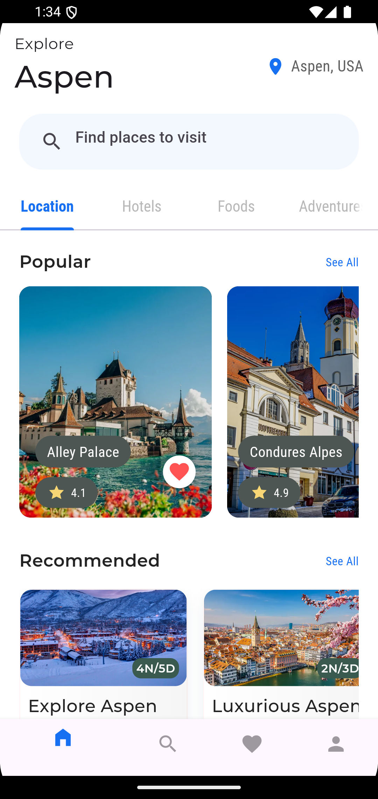
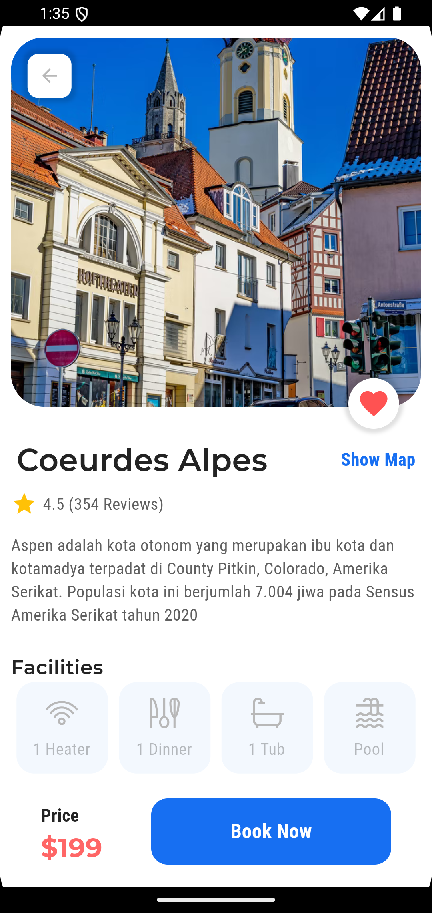

# Aspen Flutter

Aspen Flutter is a cross-platform mobile, web, and desktop application built using the Flutter framework.

## Features

- **Cross-platform**: Runs on Android, iOS, Web, and Desktop.
- **Responsive UI**: Optimized for various screen sizes.
- **Customizable**: Easy to modify and extend for different projects.

## Getting Started

### Prerequisites

Make sure you have Flutter installed on your system. If not, follow the [Flutter installation guide](https://flutter.dev/docs/get-started/install) for your OS.

### Setup

1. Clone the repository:
   ```
   git clone https://github.com/your-username/aspen_flutter.git
   cd aspen_flutter
   ```

2. Install the required dependencies:
   ```
   flutter pub get
   ```

3. Run the project on your desired platform:
   ```
   flutter run
   ```

### Building for Production

- **Android**:
  ```
  flutter build apk
  ```

- **iOS**:
  ```
  flutter build ios
  ```

- **Web**:
  ```
  flutter build web
  ```

- **Windows**:
  ```
  flutter build windows
  ```

## Screenshots

Here are some screenshots of the application:

| Splash Screen        | Home Screen    | Detail Screen    |
|--------------------|-------------------|--------------------|
|  |  |  |

## Folder Structure

- **lib/**: Contains the main Dart code.
- **assets/**: Stores static assets like images, fonts, etc.
- **android/**, **ios/**, **web/**, **windows/**: Platform-specific files.
- **pubspec.yaml**: Manages project dependencies.

## Contributing

Feel free to fork the repository and submit pull requests to contribute to the project.

## Credits

This project was inspired by the fantastic work of [Johannes Milke](https://www.youtube.com/@JohannesMilke) on his Flutter tutorials. Special thanks to his [YouTube video](https://youtu.be/HC-FOF-SoFc?si=HG_8toBzYu-p_EJ4), which provided a great foundation for this app. If you're looking to learn Flutter, check out his channel for amazing tutorials!

## License

This project is licensed under the MIT License - see the [LICENSE](LICENSE) file for details.

